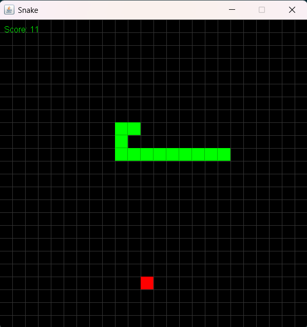

# Snake Game (Java Swing)

A simple **Snake Game** built using **Java Swing**.  
The player controls the snake with the arrow keys, trying to eat food and grow without colliding with itself or the walls.

---

## Screenshot

---

## Features

- Classic Snake gameplay
- Score tracking
- Game Over detection
- Grid-based board
- Smooth keyboard controls

---

## Technologies Used

- Java
- Swing (for GUI)
